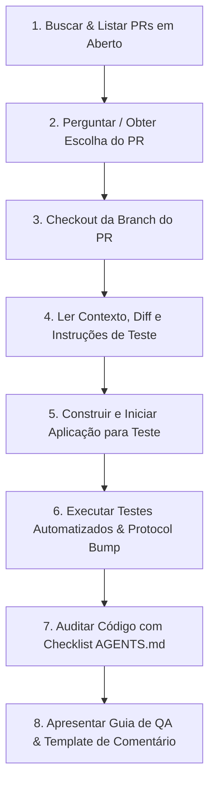

# Skill de Revisão de PR & Teste Rápido (Monky)

Esta skill guia o processo de auditoria de código, verificação técnica e inicialização rápida do ambiente de testes para Pull Requests no repositório **Monky**, aplicando com rigor as diretrizes de engenharia de software e fluxo de trabalho do [AGENTS.md](../../../AGENTS.md).

---

## 🎯 Fluxo de Execução Passo a Passo



---

## Passo 1: Buscar & Listar PRs em Aberto

Execute o comando `gh` para listar os PRs abertos no repositório:

```bash
gh pr list --state open --json number,title,headRefName,author,updatedAt --template "{{range .}}#{{.number}} - {{.title}} (branch: {{.headRefName}}, autor: {{.author.login}}){{\"\n\"}}{{end}}"
```

Apresente a lista formatada ao usuário e solicite qual PR ele deseja revisar e testar (caso o número do PR já não tenha sido informado na mensagem inicial).

---

## Passo 2: Checkout da Branch do PR

Após a definição do número do PR (`<PR_NUMBER>`):

1. Faça o checkout da branch do PR:
   ```bash
   gh pr checkout <PR_NUMBER>
   ```
2. Caso ocorra conflito de branch local, use `git checkout` ou sincronize com a branch remota.

---

## Passo 3: Ler Contexto do PR e Mudanças

1. **Obter detalhes, descrição e comentários do PR:**
   ```bash
   gh pr view <PR_NUMBER> --comments
   ```
2. **Listar arquivos alterados e escopo:**
   ```bash
   git diff main...HEAD --name-only
   ```
3. **Analisar áreas modificadas do Monorepo:**
   - `apps/client/`: Mudanças no app Electron/Renderer/Áudio/WebRTC.
   - `apps/server/`: Mudanças no servidor WebSocket/SQLite/Sinalização.
   - `packages/shared/`: Mudanças nos contratos de IPC, protocolo WebSocket, tipos e validadores.
   - `apps/server-gui/`: Mudanças na interface visual do servidor.
   - `docs-site/` ou `docs/`: Documentação e documentação traduzida (PT/EN).
   - `native/screen-audio`: Módulo nativo C++/Node-API.
4. **Extrair o Guia de QA existente:**
   - Verifique se a descrição do PR ou comentário na issue associada já possui a seção `### 🧪 Como testar (Guia de Validação para QA)`. Se não possuir, elabore uma a partir das alterações inspecionadas.

---

## Passo 4: Construir e Iniciar a Aplicação para Teste Rápido

Para que o testador valide o PR imediatamente sem atrito, prepare o ambiente e inicie os componentes necessários:

1. **Escolher o cenário pelo alvo do teste, antes de abrir o app.**
   Use o fluxo explícito [QA preparado no CONTRIBUTING](../../../CONTRIBUTING.md),
   não um `npm start` genérico com servidores, identidades ou consentimentos do
   desenvolvedor. O launcher compila esta branch e usa servidor, cliente e SDK
   reais, com dados novos em `.qa\runs\<cenário>-<id>`.

   | Alvo | Comando / cenário |
   |---|---|
   | Chat ou funcionalidade que pressupõe login | `npm run qa -- connected` |
   | Configurações do servidor | `npm run qa -- server-settings` |
   | Voz P2P local | `npm run qa -- voice` (peer SDK sintético, não música de produção) |
   | Home, adicionar/criar servidor | `npm run qa -- home` (não salva nem autentica servidor) |
   | Login | `npm run qa -- login` (preenche o formulário, não envia) |
   | Instalar bot | `npm run qa -- bot-install --bot=fixture` (preenche URL, não instala) |
   | Consentimento/preparo de ferramenta | `npm run qa -- tool-consent --bot=fixture` (não concede consentimento nem instala ferramentas) |
   | Música de produção | `npm run qa -- music --bot-root="C:\Projetos\MonkyBot"` |

   Para testar o bot real em qualquer cenário com bot, informe um checkout
   `@monky/bot` compilado e compatível via `--bot-root`. Nunca substitua música
   de produção pela fixture sem avisar. `music` pede o consentimento real e
   espera ferramentas verificadas; cancelamento, bot ou ferramenta ausente
   impedem declarar prontidão. Reprodução e busca continuam sendo o teste.
   O checkout de produção deve exportar sua declaração `requestedCapabilities`
   junto de `registerAllCommands`, conforme CONTRIBUTING. QA aprova somente
   o manifest realmente revisado pelo owner, usando as APIs autorizadas; não
   escreva grants diretamente no banco. `bot-install` mantém a revisão pendente.

2. **Executar e comprovar prontidão.**
   Aguarde `QA_READY`: a janela aberta, um PID ou uma porta não comprovam
   autenticação, mensagem persistida, catálogo ou peer. Para validação
   automatizada sem janela visível, acrescente `--smoke`; para música que exige
   consentimento humano, esse modo deve falhar claramente, nunca aprovar o
   diálogo pelo usuário. Após build, `npm run test:qa` valida o fluxo.

   O helper também aceita `start client <cenário> [opções]` e `start server
   <cenário> [opções]`, sempre no checkout que contém o helper. Documentação
   continua usando `npm run docs:dev`.

3. **Entregar um roteiro que não pule o alvo.**
   Liste o que foi preparado e o que o desenvolvedor ainda precisa executar.
   Se o teste é admissão do bot na voz, use `connected --bot-root=...`, não
   `voice`/`music`, que já o colocam na chamada. Se é identidade, onboarding,
   atualização automática, atalhos globais, LAN ou captura física, não use o
   modo preparado: abra o app comum com perfil próprio e execute essa etapa.

4. **Isolamento e encerramento são parte do teste.**
   - Cliente e servidor vêm da mesma branch/protocolo; nunca reaproveite um servidor já aberto.
   - A trava de instância é **por perfil**, não por máquina. O perfil de QA é único e não reutiliza a instalação nem outro worktree.
   - O launcher não captura microfone/câmera reais automaticamente, não anuncia na LAN e isola dados, sessão, HOME e `MONKY_HOME`.
   - Use o processo anexado à sessão, sem daemon/detach. Feche a janela ou envie `Ctrl+C` ao launcher: ele encerra seus filhos por PID e remove seus dados. Falhas fazem a mesma limpeza; nunca mate por nome.
   - O peer SDK valida P2P local, não rede entre máquinas, hardware ou SFU. Esses casos ainda exigem participantes/dispositivos reais e roteiro específico.

---

## Passo 5: Executar Testes Automatizados & Verificações do CI

Execute a suite de testes locais para garantir que não houve regressão:

```bash
# 1. Rodar suite completa de testes e versionamento
npm test

# 2. Verificar conformidade de protocolo / breaking changes
node scripts/check-protocol-bump.js
```

---

## Passo 6: Auditoria Técnica de Código (Checklist AGENTS.md)

Inspecione o diff do código (`git diff main...HEAD`) e avalie os seguintes pontos críticos (detalhados em [agents_guidelines.md](./references/agents_guidelines.md)):

### 1. 🔹 Electron, IPC & Segurança
- `contextIsolation: true` e `nodeIntegration: false` mantidos.
- Tipagem estrita de IPC via `packages/shared/src/ipc.ts` (sem strings mágicas ou `any`).
- Sem memory leaks em listeners de IPC (`ipcRenderer.on` / `ipcMain.on` duplicados).
- Sanitização de inputs no Main Process (abertura de links com `shell.openExternal`, validação de caminhos).

### 2. 🔹 WebRTC, Áudio & Vídeo
- Teardown completo de `RTCPeerConnection` e `MediaStreamTrack.stop()`.
- Cleanup na Web Audio API (`AudioContext.close()`, desconexão de nós).
- Resiliência contra race conditions em trocas de SDP/ICE.

### 3. 🔹 Módulo Nativo C++ (`@monky/screen-audio`)
- Memory safety e liberação de buffers WASAPI/CoreAudio.
- Uso de `napi_threadsafe_function` para callbacks sem travar a thread do Node.js.
- Tratamento de exceções para evitar crash no processo Main.

### 4. 🔹 Renderer Vanilla TS & DOM
- Limpeza rigorosa de event listeners (`removeEventListener`, `EventBus.off`).
- Mutações de estado centralizadas nas Stores sem dependências circulares.
- Prevenção de reflows excessivos e re-renderizações desnecessárias.

### 5. 🔹 Servidor & Clean Architecture
- Separação clara: `domain`, `application`, `infrastructure`.
- SQLite com queries parametrizadas e transações em lote.
- Heartbeats de WebSocket (ping/pong) e remoção de peers desconectados.

### 6. 🔹 Rigor TypeScript & Protocol Version
- Zero `any` e sem asserções forçadas (`as unknown as Type`).
- Se houve breaking change no protocolo ou mensagens, verificar se o SemVer reflete versão Major (`feat!:` / `major:`).

---

## Passo 7: Relatório Didático & Template de Comentário

Ao concluir a análise, apresente:
1. **Resumo Executivo da Revisão:** O que a alteração faz e avaliação técnica.
2. **Pontos de Atenção / Sugestões (se houver):** Explicando a causa-raiz, sintoma real e sugestão de código refatorado.
3. **Template de Comentário em PT-BR Pronto para Uso:** Estruturado conforme exigido no [AGENTS.md](../../../AGENTS.md) (consulte [qa_comment_template.md](./references/qa_comment_template.md)).

---

## 📚 Arquivos de Referência

- [Diretrizes Técnicas e de Arquitetura (AGENTS.md)](./references/agents_guidelines.md)
- [Templates de Comentário para Issue e QA](./references/qa_comment_template.md)
