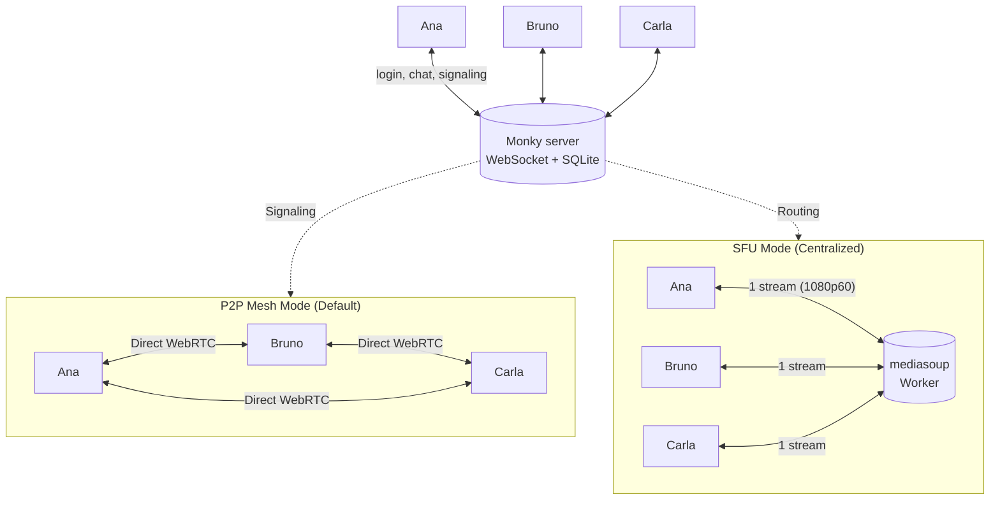

<div align="center">
  
  <h1>Monky 🎙️</h1>
  <p><b>Voice, video, screen sharing and chat with your friends — on your own server, no sign-up and no company in the middle.</b></p>

  <p>
    <a href="https://github.com/MonkyOrg/Monky/releases/latest"></a>
    <a href="https://monkyorg.github.io/Monky/en/"></a>
    <a href="https://buymeacoffee.com/monkyorg"></a>
    <a href="LICENSE"></a>
    <a href="https://github.com/MonkyOrg/Monky/actions/workflows/ci.yml"></a>
    <a href="https://github.com/MonkyOrg/Monky/discussions/categories/ideas"></a>
  </p>

  <p><a href="README.md">Português</a> · <b>English</b></p>
</div>

---

## 🤔 What Monky is

Monky is a desktop app (Windows and macOS) for voice, video, screen sharing and chat with your friends — a stripped-down Discord, except **the server is yours**.

How it works in practice:

1. **One person hosts** from the app or on a VPS, with no account, email or cloud in between.
2. **Friends join** by entering the server IP and port.
3. **The conversation is direct or centralized:** by default, voice, video and screen sharing travel P2P via WebRTC (direct mesh); for larger groups or demanding 1080p 60fps streams, the host can enable **SFU mode** (Selective Forwarding Unit with `mediasoup`). When two members are behind CGNAT and cannot connect in P2P mode, a Linux host can enable an [optional TURN relay](https://monkyorg.github.io/Monky/en/cli#media-relay-turn).

Everything of yours stays with you: history and users in the host's SQLite (`server.db`); nickname, avatar and preferences on your PC.

## ⬇️ Install

Download the latest version from [github.com/MonkyOrg/Monky/releases/latest](https://github.com/MonkyOrg/Monky/releases/latest).

| System | File | Note |
|---|---|---|
| Windows 10/11 (x64) | `Monky-<version>-win-x64-setup.exe` | Installer — lets you pick the folder |
| Windows 10/11 (x64) | `Monky-<version>-win-x64-portable.exe` | Installs nothing, just run it |
| macOS (Intel / Apple Silicon) | `Monky-<version>-mac-<arch>.dmg` | Pick `x64` (Intel) or `arm64` (M1/M2/M3+) |

If Windows/macOS shows a security warning, see [Download](https://monkyorg.github.io/Monky/en/download). For checksums and signatures, see [Verify Releases](https://monkyorg.github.io/Monky/en/verificar-releases).

## 📚 Documentation

Full usage and hosting manual at **[monkyorg.github.io/Monky/en](https://monkyorg.github.io/Monky/en/)** — installation, getting started, creating a server, hosting on a VPS and troubleshooting. ([Português](https://monkyorg.github.io/Monky/))

## 🧩 The 2 products

- **Monky** — client app for talking to friends. It also hosts the server, with a **Server Monitor** for live metrics and logs.
- **[Monky CLI](https://monkyorg.github.io/Monky/en/cli)** — command-line administration, ideal for VPS. Install it from the release, run `monky create` and you are done; a single machine can host as many servers as you want.

## 🏗️ How it works inside

Monky separates **what the server controls** from **what travels between people**, supporting two media topologies:



- **P2P Mesh (Default):** The server only signals; audio, video and screen go directly between users. No media bandwidth is consumed on the host.
- **Centralized SFU (mediasoup):** The server routes WebRTC streams. Screen sharing at 1080p60 sends only 1 stream, saving CPU and upload. If the SFU process goes down, the client says so on screen and rebuilds the session by itself once it is back.

The full detail — protocol, public-key authentication, database, permissions, media plane topologies, quality profiles and limits — lives in **[Architecture](https://monkyorg.github.io/Monky/en/arquitetura)**.


## 🗳️ Roadmap & Voting

The community decides the next versions: [suggest ideas](https://github.com/MonkyOrg/Monky/discussions/new?category=ideas), [vote on open ideas](https://github.com/MonkyOrg/Monky/discussions/categories/ideas) or follow [issues](https://github.com/MonkyOrg/Monky/issues).

## 🤝 How to contribute

Bugs start in [Discussions › Bug Reports](https://github.com/MonkyOrg/Monky/discussions/new?category=bug-reports). Code and documentation changes are welcome through PRs; read [CONTRIBUTING.en.md](CONTRIBUTING.en.md).

## 💻 For developers

Requirements: Node.js 22+ (the version CI uses) and npm. On Windows, native modules need Python 3.11 x64 and Visual Studio **2022 (17.x)** C++ tools. Capture preparation selects v143/MSVC 14.30–14.44 even with a newer VS installed; VS2026 does not replace this prerequisite. Also check ATL/MFC and SDK 10.0.26100.0 with minimum servicing 10.0.26100.3323 in the guide below.

```bash
npm ci
npm run build
npm start
npm test
```

The screen-sharing picker has two tabs: **Screens** and **Windows**.
After selecting a window, choose **Window Capture (WGC)** (default)
or **Game Capture (hook)** and confirm. These are methods for the same window,
not separate lists or automatic game detection.
The list appears before its thumbnails: each pending preview has a skeleton,
without blocking selection or sharing. Screen and window previews load
independently. A memory-only cache, lasting up to 10 seconds and bounded to
8 MiB/256 images, speeds up reopening; **Refresh** invalidates it and enumerates
source identities again. Preview failures do not block valid sources or bypass
window verification before sharing.
**Keep aspect ratio** starts enabled in every new picker: it fits the whole
window into the video frame without distortion, adding borders when needed.
Turning it off stretches the window to fill that frame. This per-share choice
survives quality changes and reconnection; it does not resize the window or monitor.

For native **window, monitor or Game Capture** on Windows x64, follow the
[module guide](apps/client/native/screen-share/README.en.md): rebuilding addons
for the pinned Electron, preparing libobs/WebRTC and meeting Python 3.11/MSVC/SDK
prerequisites are separate steps. Capture remains libobs in both **Hardware**
(recommended, AMD AMF/NVIDIA NVENC) and **Software** (CPU) encoding modes.
Only in **Settings → Quality & sharing → Screen encoding and codec**,
**Automatic** (the default) controls the whole group:
Hardware + AV1, Hardware + H.264, then Software + H.264. Read-only encoding and
codec fields show the verified result. Fallback is reported without changing
Automatic mode or saved manual choices; reopening checks hardware again.
**Manual** selects exactly Hardware/Software and H.264/AV1, with no Automatic
codec option. Combinations are checked before saving or reapplying a stream;
an unsupported choice or failed check does not replace saved preferences.
Unsupported codecs are disabled, including keyboard menu navigation, with a
localized explanation. Software + AV1 remains available when its own check succeeds.
Mode cards identify their available codec so alternatives stay reachable without
silently substituting selections. If only FPS is incompatible, lower rates are
tested in descending order (for example, H.264 4K120 → 90 → 60); only the confirmed
FPS is applied, preserving codec, mode, resolution and bitrate. Driver failures
never trigger this adjustment and remain retryable. Earlier explicit Software or
codec preferences migrate to Manual. Screen choices remain independent of the
camera. Real driver/runtime errors are reported rather than silently changing modes.

Encoder availability is checked for the selected codec and quality without
capturing a source; confirmation then probes the exact selected source.

For settings (`settingsNavigationSmoke.cjs`) and media (`nativeScreenAppSmoke.cjs`)
smokes, `$env:MONKY_TEST_DISPLAY='2'` places only test-owned windows on Windows
device `DISPLAY2`, including synthetic sources and reopened receivers. The option
fails explicitly if that monitor is absent, logs PID/title/coordinates, and never
shrinks the requested dimensions to fit. It does not affect the installation,
user windows or OS display configuration; unset, existing placement is unchanged.
The device must be non-primary and left of the primary display. The single helper
`apps\client\test\fixtures\testDisplay.cjs` logs and passes verified bounds to the
constructor before showing anything, using `showInactive` where current focus
can be preserved.
`node apps\client\test\settingsNavigationSmoke.cjs --verify-display-placement`
checks initial native bounds for hidden 480p/720p windows, including reopening and
Main-style imports, without showing windows, focusing, capturing media or starting Vite.
The whole window must fit within the monitor's work area at its actual DPI. An
oversized request (such as a 4K source on a 2560×1440 display) fails without reducing
quality or spilling onto another monitor.

The screen-share picker uses saved preferences without repeating mode, encoding
and codec controls; a failed verification blocks startup and reports the reason.
There is no mid-stream mode switch, Chromium capture fallback or GPU-brand
compatibility guarantee. Receivers without the chosen codec report incompatibility;
select H.264 on the publisher for them. Browser AV1 admission also checks the
advertised and negotiated receive level for the selected quality; generic AV1
support is not a promise of 1080p/4K support. AV1 widths are aligned down to eight
pixels before capture (for example, 852 becomes 848), keeping announced and encoded
dimensions identical; H.264 retains four-pixel alignment. The server does not transcode.
Its SFU advertises AV1 profile 0, tier 0, level-index 23 for forwarding, not decoding;
the sender must still respect each receiver's negotiated level.
For isolated full-app checks with an owned synthetic window, run
`node apps\client\test\nativeScreenAppSmoke.cjs --screen-codec=av1 --native-1080p60 --video-only --sample-seconds=10 --cadence-diagnostics --artifacts=<new-absolute-directory>`.
Codec choices are `auto`, `h264`, and `av1`; omit `--native-1080p60` for the native
1080p120 scenario. The smoke also preserves aspect ratio by default
(`--preserve-aspect-ratio` remains accepted); use `--stretch` to verify explicit OFF.
The 1080p120 minimum remains 100 presented FPS. Samples of eight seconds
or longer include a three-second warm-up. Run GPU scenarios sequentially.
Client/server protocol 28 is required for screen codec metadata; older clients
are not advertised as compatible. `npm ci` and `npm run build` alone do not prepare this runtime.
On first setup, or when `screen-audio` sources or Electron change, follow the
guide's `buildScreenAudio.cjs`: it uses local `node-gyp` and the same VS2022/MSVC/SDK
selector, after `prepare:native-screen`. Preparation builds `screen-share`
RTC/capture, not `screen_audio.node`. An already-compatible addon does not need
rebuilding for a scripts/TypeScript-only update.

Preparation is required before Windows packaging. When redistributing, include
licenses, the same-tag code and the native source archive with its JSON manifest
as described in the guide; do not copy just the executable or mix OBS runtimes.

Architecture details live in [Architecture](https://monkyorg.github.io/Monky/en/arquitetura), the contribution flow in [CONTRIBUTING.en.md](CONTRIBUTING.en.md) and the server commands in the [Monky CLI manual](https://monkyorg.github.io/Monky/en/cli). The project's original specification — with MVP and roadmap — is kept in [docs/especificacao-tecnica.md](docs/especificacao-tecnica.md).

## ☕ Support the Project

If you love Monky and want to support ongoing development, buy us a coffee! Every contribution helps keep the project active and thriving:

👉 **[buymeacoffee.com/monkyorg](https://buymeacoffee.com/monkyorg)**

## 📄 License

[GNU GPL version 3 or later](LICENSE) — free software, without warranty.
You may use, modify and redistribute Monky under these terms; when distributing
binaries, also provide the corresponding source code and license notices.
Copyright (c) 2026 Monky Contributors. The [original MIT notice](LICENSE-MIT)
is preserved for code previously published under that license. Third-party
dependencies retain their own notices and licenses.
