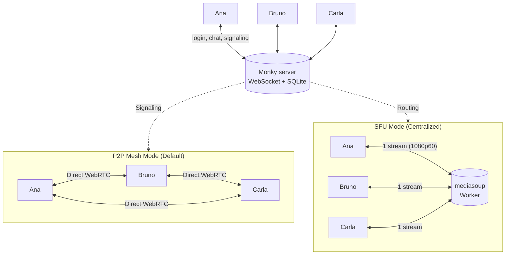

<div align="center">
  
  <h1>Monky 🎙️</h1>
  <p><b>Voice, video, screen sharing and chat with your friends — on your own server, no sign-up and no company in the middle.</b></p>

  <p>
    <a href="https://github.com/MonkyOrg/Monky/releases/latest"></a>
    <a href="https://monkyorg.github.io/Monky/en/"></a>
    <a href="https://buymeacoffee.com/monkyorg"></a>
    <a href="LICENSE"></a>
    <a href="https://github.com/MonkyOrg/Monky/actions/workflows/ci.yml"></a>
    <a href="https://github.com/MonkyOrg/Monky/discussions/categories/ideas"></a>
  </p>

  <p><a href="README.md">Português</a> · <b>English</b></p>
</div>

---

## 🤔 What Monky is

Monky is a desktop app (Windows and macOS) for voice, video, screen sharing and chat with your friends — a stripped-down Discord, except **the server is yours**.

How it works in practice:

1. **One person hosts** from the app or on a VPS, with no account, email or cloud in between.
2. **Friends join** by entering the server IP and port.
3. **The conversation is direct or centralized:** by default, voice, video and screen sharing travel P2P via WebRTC (direct mesh); for larger groups or demanding 1080p 60fps streams, the host can enable **SFU mode** (Selective Forwarding Unit with `mediasoup`). When two members are behind CGNAT and cannot connect in P2P mode, a Linux host can enable an [optional TURN relay](https://monkyorg.github.io/Monky/en/cli#media-relay-turn).

Everything of yours stays with you: history and users in the host's SQLite (`server.db`); nickname, avatar and preferences on your PC.

## ⬇️ Install

Download the latest version from [github.com/MonkyOrg/Monky/releases/latest](https://github.com/MonkyOrg/Monky/releases/latest).

| System | File | Note |
|---|---|---|
| Windows 10/11 (x64) | `Monky-<version>-win-x64-setup.exe` | Installer — lets you pick the folder |
| Windows 10/11 (x64) | `Monky-<version>-win-x64-portable.exe` | Installs nothing, just run it |
| macOS (Intel / Apple Silicon) | `Monky-<version>-mac-<arch>.dmg` | Pick `x64` (Intel) or `arm64` (M1/M2/M3+) |

If Windows/macOS shows a security warning, see [Download](https://monkyorg.github.io/Monky/en/download). For checksums and signatures, see [Verify Releases](https://monkyorg.github.io/Monky/en/verificar-releases).

## 📚 Documentation

Full usage and hosting manual at **[monkyorg.github.io/Monky/en](https://monkyorg.github.io/Monky/en/)** — installation, getting started, creating a server, hosting on a VPS and troubleshooting. ([Português](https://monkyorg.github.io/Monky/))

## 🧩 The 2 products

- **Monky** — client app for talking to friends. It also hosts the server, with a **Server Monitor** for live metrics and logs.
- **[Monky CLI](https://monkyorg.github.io/Monky/en/cli)** — command-line administration, ideal for VPS. Install it from the release, run `monky create` and you are done; a single machine can host as many servers as you want.

## 🏗️ How it works inside

Monky separates **what the server controls** from **what travels between people**, supporting two media topologies:



- **P2P Mesh (Default):** The server only signals; audio, video and screen go directly between users. No media bandwidth is consumed on the host.
- **Centralized SFU (mediasoup):** The server routes WebRTC streams. Screen sharing at 1080p60 sends only 1 stream, saving CPU and upload. If the SFU process goes down, the client says so on screen and rebuilds the session by itself once it is back.

The full detail — protocol, public-key authentication, database, permissions, media plane topologies, quality profiles and limits — lives in **[Architecture](https://monkyorg.github.io/Monky/en/arquitetura)**.


## 🗳️ Roadmap & Voting

The community decides the next versions: [suggest ideas](https://github.com/MonkyOrg/Monky/discussions/new?category=ideas), [vote on open ideas](https://github.com/MonkyOrg/Monky/discussions/categories/ideas) or follow [issues](https://github.com/MonkyOrg/Monky/issues).

## 🤝 How to contribute

Bugs start in [Discussions › Bug Reports](https://github.com/MonkyOrg/Monky/discussions/new?category=bug-reports). Code and documentation changes are welcome through PRs; read [CONTRIBUTING.en.md](CONTRIBUTING.en.md).

## 💻 For developers

Requirements: Node.js 22+ (the version CI uses) and npm. On Windows, native modules need Python 3.11 x64 and Visual Studio 2022 C++ tools (MSVC). For screen capture, also check ATL/MFC and the Windows SDK version in the guide below.

```bash
npm ci
npm run build
npm start
npm test
```

For native **window, monitor or Game Capture** on Windows x64, follow the
[module guide](apps/client/native/screen-share/README.en.md): rebuilding addons
for the pinned Electron, preparing libobs/WebRTC and meeting Python 3.11/MSVC/SDK
prerequisites are separate steps. Video uses H.264 through AMD AMF or NVIDIA
NVENC; AV1 is unavailable. The selected source is probed after confirmation,
with no automatic Chromium/software fallback and no compatibility guarantee
based on GPU brand. `npm ci` and `npm run build` alone do not prepare this runtime.
Explicitly rebuilding `screen-audio` with the local `node-gyp` after `npm ci`
is also mandatory in an existing checkout; `prepare:native-screen` builds
`screen-share` RTC/capture, not `screen_audio.node`.

Preparation is required before Windows packaging. When redistributing, include
licenses, the same-tag code and the native source archive with its JSON manifest
as described in the guide; do not copy just the executable or mix OBS runtimes.

Architecture details live in [Architecture](https://monkyorg.github.io/Monky/en/arquitetura), the contribution flow in [CONTRIBUTING.en.md](CONTRIBUTING.en.md) and the server commands in the [Monky CLI manual](https://monkyorg.github.io/Monky/en/cli). The project's original specification — with MVP and roadmap — is kept in [docs/especificacao-tecnica.md](docs/especificacao-tecnica.md).

## ☕ Support the Project

If you love Monky and want to support ongoing development, buy us a coffee! Every contribution helps keep the project active and thriving:

👉 **[buymeacoffee.com/monkyorg](https://buymeacoffee.com/monkyorg)**

## 📄 License

[GNU GPL version 3 or later](LICENSE) — free software, without warranty.
You may use, modify and redistribute Monky under these terms; when distributing
binaries, also provide the corresponding source code and license notices.
Copyright (c) 2026 Monky Contributors. The [original MIT notice](LICENSE-MIT)
is preserved for code previously published under that license. Third-party
dependencies retain their own notices and licenses.
