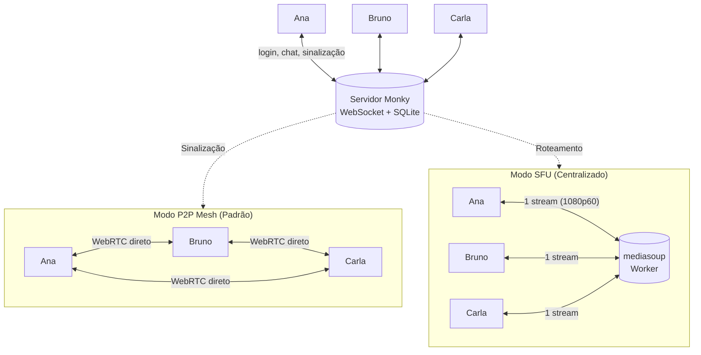

<div align="center">
  
  <h1>Monky 🎙️</h1>
  <p><b>Voz, vídeo, tela e chat entre amigos — no seu próprio servidor, sem cadastro e sem empresa nenhuma no meio.</b></p>

  <p>
    <a href="https://github.com/MonkyOrg/Monky/releases/latest"></a>
    <a href="https://monkyorg.github.io/Monky/"></a>
    <a href="https://buymeacoffee.com/monkyorg"></a>
    <a href="LICENSE"></a>
    <a href="https://github.com/MonkyOrg/Monky/actions/workflows/ci.yml"></a>
    <a href="https://github.com/MonkyOrg/Monky/discussions/categories/ideas"></a>
  </p>

  <p><b>Português</b> · <a href="README.en.md">English</a></p>
</div>

---

## 🤔 O que é o Monky

Monky é um aplicativo desktop (Windows e macOS) para voz, vídeo, compartilhamento de tela e chat entre amigos — no estilo de um Discord enxuto, só que **o servidor é seu**.

Como funciona na prática:

1. **Uma pessoa hospeda** pelo app ou em um VPS, sem conta, e-mail ou nuvem no meio.
2. **Os amigos entram** informando IP e porta.
3. **A conversa é direta ou centralizada:** por padrão, voz, vídeo e tela trafegam P2P via WebRTC (mesh direto); para chamadas maiores e transmissões pesadas em 1080p 60fps, o anfitrião pode ativar o modo **SFU** (Selective Forwarding Unit com `mediasoup`). Quando dois membros estão atrás de CGNAT e não conseguem se conectar no modo P2P, quem hospeda em Linux pode ligar um [relay TURN opcional](https://monkyorg.github.io/Monky/cli#relay-de-midia-turn).

Tudo o que é seu fica com você: histórico e usuários no SQLite (`server.db`) do anfitrião; nickname, avatar e preferências no seu PC.

## ⬇️ Instalar

Baixe a versão mais recente em [github.com/MonkyOrg/Monky/releases/latest](https://github.com/MonkyOrg/Monky/releases/latest).

| Sistema | Arquivo | Observação |
|---|---|---|
| Windows 10/11 (x64) | `Monky-<versão>-win-x64-setup.exe` | Instalador — permite escolher a pasta |
| Windows 10/11 (x64) | `Monky-<versão>-win-x64-portable.exe` | Não instala nada, é só executar |
| macOS (Intel / Apple Silicon) | `Monky-<versão>-mac-<arch>.dmg` | Escolha `x64` (Intel) ou `arm64` (M1/M2/M3+) |

Se o Windows/macOS mostrar aviso de segurança, veja [Download](https://monkyorg.github.io/Monky/download). Para checksums e assinatura, veja [Verificar Releases](https://monkyorg.github.io/Monky/verificar-releases).

## 📚 Documentação

Manual completo de uso e hospedagem em **[monkyorg.github.io/Monky](https://monkyorg.github.io/Monky/)** — instalação, primeiros passos, criar servidor, hospedar em VPS e solução de problemas. ([English](https://monkyorg.github.io/Monky/en/))

## 🧩 Os 2 produtos

- **Monky** — app cliente para conversar com amigos. Ele também hospeda o servidor, com **Monitor do Servidor** para métricas e logs ao vivo.
- **[Monky CLI](https://monkyorg.github.io/Monky/cli)** — administração por linha de comando, ideal para VPS. Instale pela release, rode `monky create` e pronto; a mesma máquina pode hospedar quantos servidores quiser.

## 🏗️ Como funciona por dentro

O Monky separa **o que o servidor controla** do **que trafega entre as pessoas**, suportando dois modos de mídia:



- **P2P Mesh (Padrão):** O servidor apenas sinaliza; áudio, vídeo e tela vão direto entre os usuários. Não consome banda de mídia no host.
- **SFU Centralizado (mediasoup):** O servidor roteia os fluxos WebRTC. Quem compartilha tela em 1080p60 envia apenas 1 stream, economizando CPU e upload. Se o processo SFU cair, o cliente avisa em tela e refaz a sessão sozinho assim que ele voltar.

O detalhe completo — protocolo, autenticação por chave pública, banco, permissões, topologias de mídia, perfis de qualidade e limites — está em **[Arquitetura](https://monkyorg.github.io/Monky/arquitetura)**.


## 🗳️ Roadmap & Votação

A comunidade decide as próximas versões: [sugira ideias](https://github.com/MonkyOrg/Monky/discussions/new?category=ideas), [vote nas ideias abertas](https://github.com/MonkyOrg/Monky/discussions/categories/ideas) ou acompanhe as [issues](https://github.com/MonkyOrg/Monky/issues).

## 🤝 Como colaborar

Bugs começam em [Discussions › Bug Reports](https://github.com/MonkyOrg/Monky/discussions/new?category=bug-reports). Mudanças de código e documentação são bem-vindas por PR; leia [CONTRIBUTING.md](CONTRIBUTING.md).

## 💻 Para desenvolvedores

Requisitos: Node.js 22+ (versão usada pelo CI) e npm. No Windows, o módulo nativo de áudio de tela precisa de Python 3.11 e Build Tools do Visual Studio (MSVC).

```bash
npm install
npm run build
npm start
npm test
```

Para transmitir janelas pelo caminho nativo libobs/AMF no Windows, prepare
também o runtime conforme o [guia do módulo](apps/client/native/screen-share/README.md).
Essa preparação é obrigatória antes de empacotar o aplicativo Windows.

Detalhes de arquitetura estão em [Arquitetura](https://monkyorg.github.io/Monky/arquitetura), o fluxo de contribuição em [CONTRIBUTING.md](CONTRIBUTING.md) e os comandos do servidor no [manual do Monky CLI](https://monkyorg.github.io/Monky/cli). A especificação original do projeto — com MVP e roadmap — ficou registrada em [docs/especificacao-tecnica.md](docs/especificacao-tecnica.md).

## ☕ Apoie o Projeto

Se você gosta do Monky e quer apoiar o desenvolvimento contínuo, pague um café para nós! Toda contribuição ajuda a manter o projeto ativo e evoluindo:

👉 **[buymeacoffee.com/monkyorg](https://buymeacoffee.com/monkyorg)**

## 📄 Licença

[GNU GPL versão 3 ou posterior](LICENSE) — software livre, sem garantia.
Você pode usar, modificar e redistribuir o Monky sob esses termos; ao distribuir
binários, disponibilize também o código-fonte correspondente e os avisos de licença.
Copyright (c) 2026 Monky Contributors. O aviso [MIT original](LICENSE-MIT) permanece
preservado para o código anteriormente publicado sob essa licença. Dependências
de terceiros mantêm seus próprios avisos e licenças.
