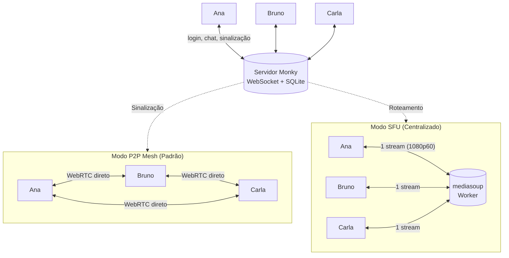

<div align="center">
  
  <h1>Monky 🎙️</h1>
  <p><b>Voz, vídeo, tela e chat entre amigos — no seu próprio servidor, sem cadastro e sem empresa nenhuma no meio.</b></p>

  <p>
    <a href="https://github.com/MonkyOrg/Monky/releases/latest"></a>
    <a href="https://monkyorg.github.io/Monky/"></a>
    <a href="https://buymeacoffee.com/monkyorg"></a>
    <a href="LICENSE"></a>
    <a href="https://github.com/MonkyOrg/Monky/actions/workflows/ci.yml"></a>
    <a href="https://github.com/MonkyOrg/Monky/discussions/categories/ideas"></a>
  </p>

  <p><b>Português</b> · <a href="README.en.md">English</a></p>
</div>

---

## 🤔 O que é o Monky

Monky é um aplicativo desktop (Windows e macOS) para voz, vídeo, compartilhamento de tela e chat entre amigos — no estilo de um Discord enxuto, só que **o servidor é seu**.

Como funciona na prática:

1. **Uma pessoa hospeda** pelo app ou em um VPS, sem conta, e-mail ou nuvem no meio.
2. **Os amigos entram** informando IP e porta.
3. **A conversa é direta ou centralizada:** por padrão, voz, vídeo e tela trafegam P2P via WebRTC (mesh direto); para chamadas maiores e transmissões pesadas em 1080p 60fps, o anfitrião pode ativar o modo **SFU** (Selective Forwarding Unit com `mediasoup`). Quando dois membros estão atrás de CGNAT e não conseguem se conectar no modo P2P, quem hospeda em Linux pode ligar um [relay TURN opcional](https://monkyorg.github.io/Monky/cli#relay-de-midia-turn).

Tudo o que é seu fica com você: histórico e usuários no SQLite (`server.db`) do anfitrião; nickname, avatar e preferências no seu PC.

## ⬇️ Instalar

Baixe a versão mais recente em [github.com/MonkyOrg/Monky/releases/latest](https://github.com/MonkyOrg/Monky/releases/latest).

| Sistema | Arquivo | Observação |
|---|---|---|
| Windows 10/11 (x64) | `Monky-<versão>-win-x64-setup.exe` | Instalador — permite escolher a pasta |
| Windows 10/11 (x64) | `Monky-<versão>-win-x64-portable.exe` | Não instala nada, é só executar |
| macOS (Intel / Apple Silicon) | `Monky-<versão>-mac-<arch>.dmg` | Escolha `x64` (Intel) ou `arm64` (M1/M2/M3+) |

Se o Windows/macOS mostrar aviso de segurança, veja [Download](https://monkyorg.github.io/Monky/download). Para checksums e assinatura, veja [Verificar Releases](https://monkyorg.github.io/Monky/verificar-releases).

## 📚 Documentação

Manual completo de uso e hospedagem em **[monkyorg.github.io/Monky](https://monkyorg.github.io/Monky/)** — instalação, primeiros passos, criar servidor, hospedar em VPS e solução de problemas. ([English](https://monkyorg.github.io/Monky/en/))

## 🧩 Os 2 produtos

- **Monky** — app cliente para conversar com amigos. Ele também hospeda o servidor, com **Monitor do Servidor** para métricas e logs ao vivo.
- **[Monky CLI](https://monkyorg.github.io/Monky/cli)** — administração por linha de comando, ideal para VPS. Instale pela release, rode `monky create` e pronto; a mesma máquina pode hospedar quantos servidores quiser.

## 🏗️ Como funciona por dentro

O Monky separa **o que o servidor controla** do **que trafega entre as pessoas**, suportando dois modos de mídia:



- **P2P Mesh (Padrão):** O servidor apenas sinaliza; áudio, vídeo e tela vão direto entre os usuários. Não consome banda de mídia no host.
- **SFU Centralizado (mediasoup):** O servidor roteia os fluxos WebRTC. Quem compartilha tela em 1080p60 envia apenas 1 stream, economizando CPU e upload. Se o processo SFU cair, o cliente avisa em tela e refaz a sessão sozinho assim que ele voltar.

O detalhe completo — protocolo, autenticação por chave pública, banco, permissões, topologias de mídia, perfis de qualidade e limites — está em **[Arquitetura](https://monkyorg.github.io/Monky/arquitetura)**.


## 🗳️ Roadmap & Votação

A comunidade decide as próximas versões: [sugira ideias](https://github.com/MonkyOrg/Monky/discussions/new?category=ideas), [vote nas ideias abertas](https://github.com/MonkyOrg/Monky/discussions/categories/ideas) ou acompanhe as [issues](https://github.com/MonkyOrg/Monky/issues).

## 🤝 Como colaborar

Bugs começam em [Discussions › Bug Reports](https://github.com/MonkyOrg/Monky/discussions/new?category=bug-reports). Mudanças de código e documentação são bem-vindas por PR; leia [CONTRIBUTING.md](CONTRIBUTING.md).

## 💻 Para desenvolvedores

Requisitos: Node.js 22+ (versão usada pelo CI) e npm. No Windows, os módulos nativos precisam de Python 3.11 x64 e ferramentas C++ do Visual Studio **2022 (17.x)**. O preparo de captura seleciona v143/MSVC 14.30–14.44, mesmo com VS mais novo instalado; VS2026 não substitui esse pré-requisito. Confira também ATL/MFC e o SDK 10.0.26100.0 com servicing mínimo 10.0.26100.3323 no guia abaixo.

```bash
npm ci
npm run build
npm start
npm test
```

O seletor de compartilhamento tem duas abas: **Telas** e **Janelas**.
Após selecionar uma janela, escolha **Captura de janela (WGC)** (padrão)
ou **Captura de jogo (hook)** e confirme. São métodos da mesma janela,
não listas separadas nem detecção automática de jogos.
A lista aparece antes das miniaturas: cada prévia pendente tem um skeleton,
sem impedir a seleção ou o compartilhamento. Telas e janelas carregam suas
prévias independentemente. Um cache de até 10 segundos, somente em memória
e limitado a 8 MiB/256 imagens, acelera reaberturas; **Atualizar** o invalida
e enumera novamente as identidades. Uma falha na prévia não bloqueia uma fonte
válida nem substitui a verificação da janela antes de compartilhar.
**Preservar proporção** inicia ligado em cada novo seletor: encaixa a janela
inteira no quadro do vídeo sem distorção, adicionando bordas quando necessário.
Desligado, estica a janela para preencher esse quadro. A escolha vale apenas para
o compartilhamento atual e é mantida ao mudar a qualidade ou reconectar; não altera
a resolução da janela nem do monitor.

Para captura nativa de **janela, monitor ou Game Capture** no Windows x64,
siga o [guia do módulo](apps/client/native/screen-share/README.md): recompilação
dos addons para o Electron fixado, preparo libobs/WebRTC e pré-requisitos
Python 3.11/MSVC/SDK são etapas distintas. A captura continua no libobs nos modos
de codificação **Hardware** (recomendado, AMD AMF/NVIDIA NVENC) e **Software** (CPU).
Somente em **Configurações → Qualidade e compartilhamento → Codificação e codec de tela**,
o modo **Automático** (padrão) controla
todo o grupo: tenta Hardware + AV1, Hardware + H.264 e depois Software + H.264.
Os campos de codificação e codec ficam somente leitura e mostram o resultado
real da verificação. O fallback é informado, mas não altera o modo Automático nem
as escolhas manuais salvas; uma nova abertura volta a verificar o hardware.
**Manual** permite escolher exatamente Hardware/Software e H.264/AV1, sem opção
de codec Automático. As combinações são verificadas antes de salvar ou reaplicar
a transmissão; uma escolha indisponível ou cuja verificação falhe não substitui
as preferências salvas. Codecs incompatíveis ficam desabilitados, inclusive no
menu por teclado, com explicação localizada. Software + AV1 continua disponível
quando sua própria verificação passa. Os cards indicam o codec disponível para
cada modo, permitindo escolher uma alternativa sem substituir escolhas silenciosamente.
Se apenas o FPS for incompatível, valores menores são testados em ordem decrescente
(por exemplo, H.264 4K120 → 90 → 60); só o FPS confirmado é aplicado, mantendo
codec, modo, resolução e bitrate. Falhas de driver não provocam esse ajuste e
permitem tentar a verificação novamente. Preferências explícitas
anteriores de Software ou codec são migradas para Manual. As escolhas de tela
continuam independentes da câmera. Erros reais de driver/runtime são exibidos,
sem troca silenciosa de modo.

A disponibilidade é verificada para o codec e a qualidade escolhidos sem capturar
uma fonte; a confirmação então verifica a fonte exata selecionada.

Nos smokes de configurações (`settingsNavigationSmoke.cjs`) e mídia
(`nativeScreenAppSmoke.cjs`), `$env:MONKY_TEST_DISPLAY='2'` posiciona somente as
janelas pertencentes ao teste no dispositivo Windows `DISPLAY2`, inclusive fontes
sintéticas e receptores reabertos. A opção falha explicitamente se o monitor não
existir, registra PID/título/coordenadas e nunca reduz as dimensões solicitadas
para caber na tela. Não altera a instalação, janelas do usuário ou a configuração
dos monitores; sem essa variável, o posicionamento existente é mantido.
O dispositivo deve ser não primário e estar à esquerda do principal. O helper
único `apps\client\test\fixtures\testDisplay.cjs` registra e passa os limites
verificados ao construtor antes de qualquer exibição, usando `showInactive`
quando pode preservar o foco atual.
`node apps\client\test\settingsNavigationSmoke.cjs --verify-display-placement`
verifica os limites iniciais de janelas ocultas 480p/720p, inclusive reabertura e
importação pelo Main, sem exibir janelas, focar, capturar mídia ou iniciar o Vite.
Toda a janela deve caber na área útil do monitor, considerando o DPI real. Se não
couber (por exemplo, uma fonte 4K em uma tela 2560×1440), o teste falha sem reduzir
a qualidade nem avançar sobre outro monitor.

O seletor de compartilhamento usa as preferências salvas, sem repetir os controles
de modo, codificação e codec; uma falha na verificação impede o início e informa o motivo.
Não há troca de modo durante a transmissão, captura alternativa pelo Chromium ou
garantia de compatibilidade pela marca da GPU. Receptores sem o codec escolhido
informam a incompatibilidade; selecione H.264 no transmissor para atendê-los.
No navegador, AV1 também exige nível de recepção anunciado e negociado compatível
com a qualidade escolhida; suporte genérico a AV1 não garante 1080p/4K.
AV1 alinha a largura para baixo em múltiplos de oito antes da captura (852 vira 848),
mantendo as dimensões anunciadas iguais às codificadas; H.264 mantém múltiplos de quatro.
O servidor não transcodifica. O SFU anuncia AV1 perfil 0, tier 0 e level-index 23
para encaminhamento, não decodificação; o transmissor ainda respeita o nível negociado
por cada receptor. Cliente e servidor exigem protocolo 28 para os
metadados de codec de tela; clientes antigos não são anunciados como compatíveis.
Para verificar o aplicativo isolado com uma janela sintética própria, execute
`node apps\client\test\nativeScreenAppSmoke.cjs --screen-codec=av1 --native-1080p60 --video-only --sample-seconds=10 --cadence-diagnostics --artifacts=<novo-diretorio-absoluto>`.
Os codecs são `auto`, `h264` e `av1`; omita `--native-1080p60` para o cenário nativo
1080p120. O smoke também preserva a proporção por padrão (`--preserve-aspect-ratio`
continua válido); use `--stretch` para verificar o OFF explícito. No cenário
1080p120, o mínimo continua em 100 FPS apresentados. Amostras de oito segundos
ou mais incluem três segundos de aquecimento. Execute os cenários de GPU sequencialmente.
`npm ci` e `npm run build` sozinhos não preparam esse runtime.
No primeiro preparo, ou se mudarem as fontes de `screen-audio` ou o Electron,
siga `buildScreenAudio.cjs` no guia: ele usa o `node-gyp` local e o mesmo
seletor VS2022/MSVC/SDK, depois de `prepare:native-screen`. Esse preparo compila
RTC/captura de `screen-share`, não o `screen_audio.node`. Um addon já compatível
não precisa ser reconstruído por uma atualização somente de scripts/TypeScript.

O preparo é obrigatório antes de empacotar no Windows. Ao redistribuir, inclua
as licenças, o código da mesma tag e o arquivo de fontes nativas com manifesto
JSON descritos no guia; não copie apenas o executável ou misture runtimes OBS.

Detalhes de arquitetura estão em [Arquitetura](https://monkyorg.github.io/Monky/arquitetura), o fluxo de contribuição em [CONTRIBUTING.md](CONTRIBUTING.md) e os comandos do servidor no [manual do Monky CLI](https://monkyorg.github.io/Monky/cli). A especificação original do projeto — com MVP e roadmap — ficou registrada em [docs/especificacao-tecnica.md](docs/especificacao-tecnica.md).

## ☕ Apoie o Projeto

Se você gosta do Monky e quer apoiar o desenvolvimento contínuo, pague um café para nós! Toda contribuição ajuda a manter o projeto ativo e evoluindo:

👉 **[buymeacoffee.com/monkyorg](https://buymeacoffee.com/monkyorg)**

## 📄 Licença

[GNU GPL versão 3 ou posterior](LICENSE) — software livre, sem garantia.
Você pode usar, modificar e redistribuir o Monky sob esses termos; ao distribuir
binários, disponibilize também o código-fonte correspondente e os avisos de licença.
Copyright (c) 2026 Monky Contributors. O aviso [MIT original](LICENSE-MIT) permanece
preservado para o código anteriormente publicado sob essa licença. Dependências
de terceiros mantêm seus próprios avisos e licenças.
